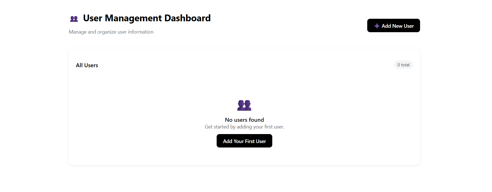

# 🧑‍💻 User Management System (MERN + MongoDB)

A full-stack **User Management Dashboard** built using the **MERN stack**.  
This project allows admins to **create, view, update, and delete** users with detailed information such as **name, email, phone, company, address, and geolocation**.  

It includes a professional **UI design** with responsive pages for Dashboard, User Form, and User Details.

---

## 🚀 Tech Stack
- **Frontend:** React.js (Hooks, React Router, Axios)  
- **Backend:** Node.js + Express.js  
- **Database:** MongoDB with Mongoose ORM  
- **Styling:** Internal CSS (modern card-based UI)  

---

## ⚙️ Setup Instructions

### 1️⃣ Clone the Repository
```bash
git clone https://github.com/your-username/user-management-system.git
cd user-management-system
```

### 2️⃣ Backend Setup
```bash
cd backend
npm install
```


- Start the backend:
```bash
npm run dev
```

### 3️⃣ Frontend Setup
```bash
cd frontend
npm install
```

- Start the frontend:
```bash
npm start
```

### 4️⃣ Access the App
Open [http://localhost:3000](http://localhost:3000) in your browser.  

---

## Screenshots

### Dashboard Page


### Add New User Page


### User Details Page


---


### Features
- Responsive **Dashboard** with user list  
- **Add New User** form with validation  
- **User Details** page with contact, address, and geo information  
- **Edit & Delete** functionality  


---

